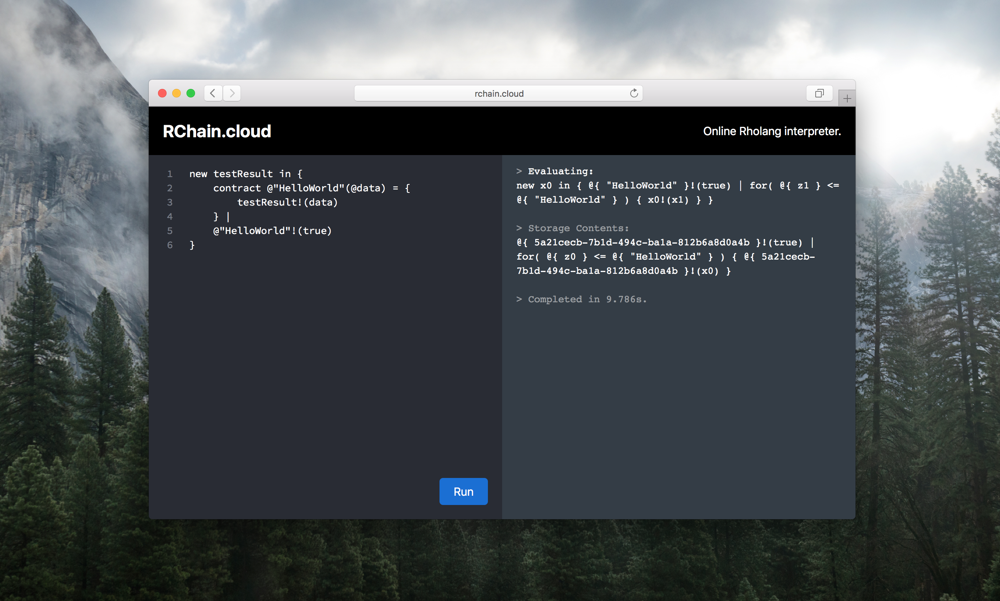

# rchain.cloud

**Web interface to play with the [Rholang](https://developer.rchain.coop/) language.**




## Find it online
Just want to play around with Rholang? Simply go to [rchain.cloud](http://rchain.cloud).


## Running it locally
If you want to help develop rchain.cloud, or run your own instance, follow these instructions:

1. Ensure [Docker](https://www.docker.com/) and [Node.JS](https://nodejs.org) (version 8 or above) are installed on your machine.
2. Clone the Github repo to your desired location using `git clone https://github.com/th3build/rchain.cloud`.
3. Install NPM dependencies: `npm install`
4. Run it: `PORT=8080 npm start`


## Development
There's always [stuff](https://github.com/th3build/rchain.cloud/issues) that you can help develop.

Mayor features that are planned:

- [ ] Snippet sharing through unique URLs
- [ ] Support 'extended Rholang syntax' (`import`/`export`)


## POST API
You can send a POST request to `http://rchain.cloud/` to seed the editor with certain content. The POST body should be form-encoded, and can contain the following parameters:

- `content`: the code you want to show in the editor
- `version`: the Docker image tag you want to use to run your code (only supports `latest` at the moment)

This functionality allows you to create a 'Run on RChain.cloud' button. Usually this is done using a [hidden HTML form](https://jsfiddle.net/0zwtnr8c/):

```html
<form target="_blank" method="POST" action="http://rchain.cloud/">
   <input type="hidden" name="content" value="Your code here!" />
   <input type="hidden" name="version" value="latest" />
   <input type="submit" value="Run on RChain.cloud" />
</form>
```
